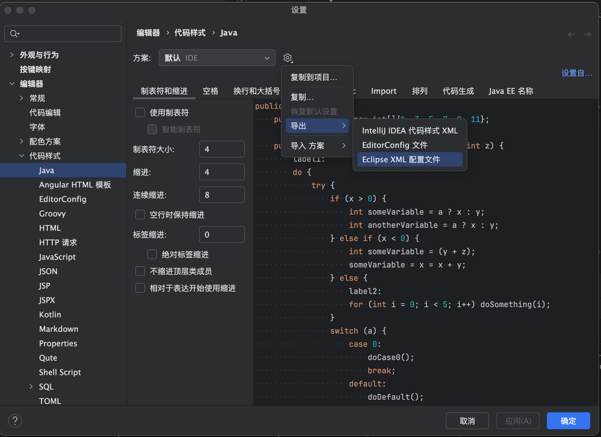

# eclipse-java

vscode java format 配置文件

1. 使用云文件
```
.vscode/settings.json
{
    "java.format.settings.url": "https://raw.githubusercontent.com/SecretLittleBoy/eclipse-java/main/eclipse-java.xml"
}
```


2. 下载至本地使用本地文件
```
.vscode/settings.json
{
    "java.format.settings.url": "/Users/yihaolong/Desktop/eclipse-java/idea_default.xml"
}
```


`eclipse-java.xml` 基于谷歌style做小修改   \
`idea_default.xml` IntelliJ IDEA默认格式  \
IntelliJ IDEA如何导出默认格式？ \

